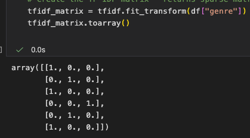

## Core Concept
This item is similar to other based on its attributes. If you liked this item, you might like these similar items.

1. Gather item attribute data (e.g., movie genres, product features)
2. Create item profiles based on attributes
3. Create user profiles based on their item preferences
4. Recommend items similar to those the user liked

## Implementation Steps
- Gathered dummy item attribute data


- Created item profiles based on attributes



``` General Trivia:
tfidf.fit_tranform(docs) -> leanrs vocabulary and IDF, returns document-term matrix (sparse matrix, shape(# of docs, # of unique words))
```

- Created user profiles based on their item preferences


``` General Trivia:
linear_kernel() -> computes A.B(Transpose) (dot product). This equals to cosine similarity only if all the vectors are L2 normalized to unit length.
cosine_similarity() -> explicitly computes cosine similarity and internally handles normalization.
```

- Recommended items similar to those the user liked using cosine similarity


**Check my code:** [content-based-recommender.ipynb](https://github.com/Akshata4/how-recommenders-work/blob/main/content-based.ipynb)